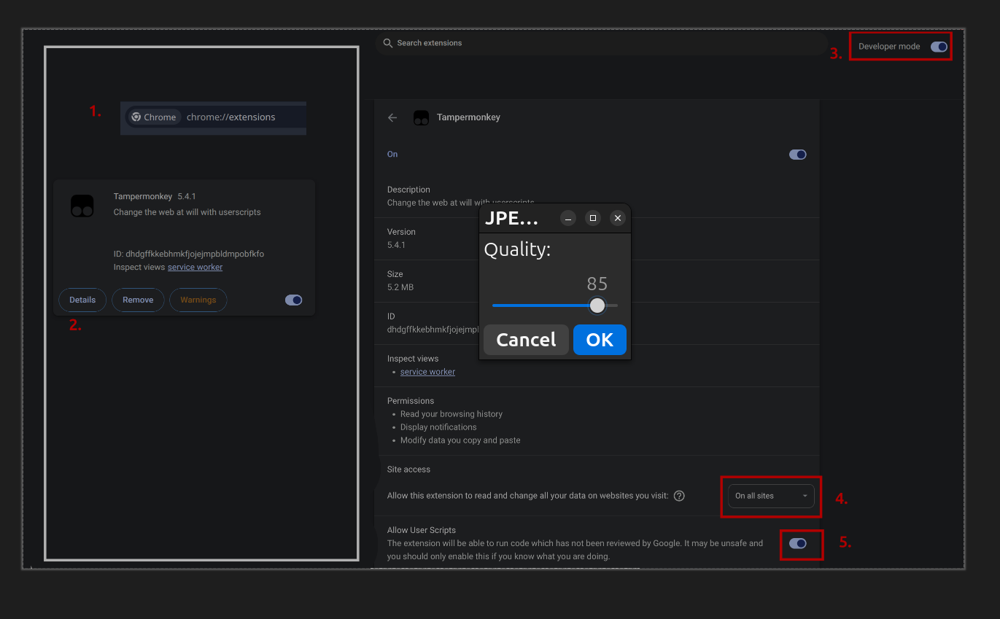
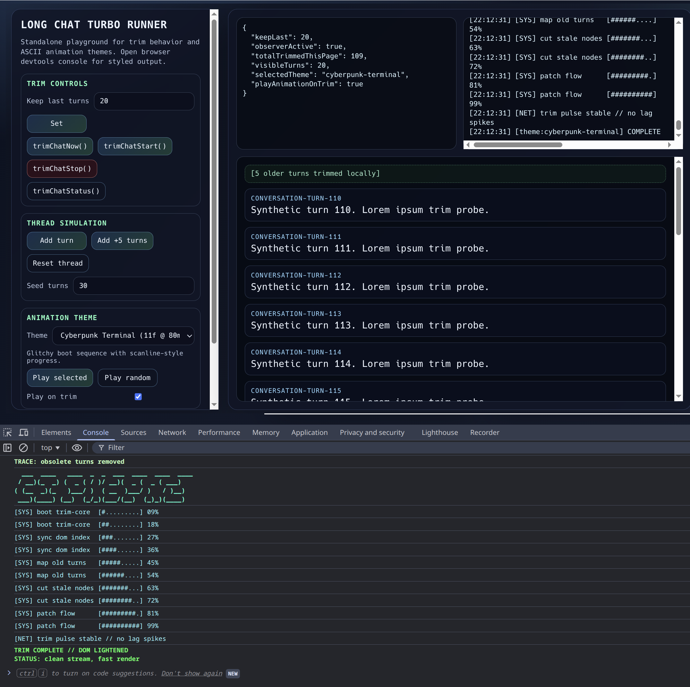

# ChatGPT Article / Chat Turn Trimmer

A lightweight Tampermonkey userscript that trims long ChatGPT conversations in the browser by hiding older turns.

When a chat gets very long, the UI becomes painful to scroll and harder to reason about. This script keeps the most recent messages visible and hides older ones, dramatically reducing scroll distance and visual clutter.

Nothing is deleted. Messages are simply hidden in the DOM.

This makes long technical sessions, deep analysis threads, and multi‑hour investigations much easier to navigate.

---

## Features

- Automatically hides older conversation turns
- Keeps the most recent turns visible
- Reduces scroll distance in very long chats
- Improves focus on the current reasoning
- Runs automatically via Tampermonkey
- Can optionally reveal hidden turns
- Optional geeky ASCII trim animations in the console (theme selectable)

This is purely a browser‑side UI helper. It does not modify the actual conversation stored by ChatGPT.

---

## Why This Exists

Long LLM sessions frequently produce hundreds of turns.

Examples:

- System archaeology
- Data model design
- Debugging sessions
- Architecture discussions
- Exploratory analysis

The ChatGPT UI renders everything at once, which causes:

- Excessive scrolling
- UI slowdown
- Difficulty focusing on the most recent reasoning

This script solves that by trimming the visible portion of the chat.

---

## Installation

### 1. Install Tampermonkey

Install the Tampermonkey browser extension. Supported browsers include:

- Chrome
- Firefox
- Edge
- Most Chromium‑based browsers

After installation, ensure Tampermonkey is enabled.

### 2. Tampermonkey Permisions


### 3. Install the userscript

1. Open Tampermonkey
2. Click **Create new script**
3. Replace the default contents with the script from `tampermonkey/chat-turn-trimmer.user.js`
4. Save the script
5. Refresh the ChatGPT page

The script will now run automatically on ChatGPT pages.

### 4. Enabling Userscripts in Chrome and Edge

Tampermonkey version 5.3+ requires an extra one-time step before userscripts will run in Chrome or Edge. This is a browser-level requirement.

The official docs are here: [Q209: Permission to execute userscripts](https://www.tampermonkey.net/faq.php#Q209) but I didn't find them particularly clear.

#### What worked for me in CHrome 144.x on Ubuntu 24

Navigate to chrome://extensions (Chrome) or edge://extensions (Edge), click `Details` on tampermonkey:

Then:





Find the Developer mode toggle in the top-right corner
Enable it

Both steps are required — do not skip either one.

Why is this required? Google requires user consent before any extension can run arbitrary userscripts. The userScripts browser permission alone is intentionally not enough — enabling Developer Mode or the Allow User Scripts toggle is the explicit opt-in.

---

## Usage

Once installed, the script activates automatically.

Typical behaviour:

1. Open a long ChatGPT conversation
2. The script hides older chat turns
3. Only the most recent turns remain visible

If the script version includes a toggle control, you can reveal hidden turns at any time.

Hidden turns are not removed from the conversation. They are only hidden in the browser.

---

## Animation Options (Tampermonkey Script)

`long-chat-turbo-monkey.js` includes built-in ASCII animation themes that run when a trim happens.

Edit the top-level `CONFIG` block:

```javascript
enableTrimAnimation: true,
trimAnimationTheme: 'cyberpunk-terminal', // cyberpunk-terminal | retro-arcade | orbital-launch | matrix-rain | robot-factory
trimAnimationFrameLimit: 0,               // 0 = all frames, >0 = cap output
trimAnimationCooldownMs: 900
```

Runtime helpers in DevTools console:

- `trimChatSetAnimationEnabled(false)`
- `trimChatSetAnimationTheme('retro-arcade')`
- `trimChatListAnimationThemes()`
- `trimChatStatus()`

---

## Standalone Runner (No Tampermonkey)

For local testing or demos, you can use the standalone runner page:

1. Open `runner.html` in your browser.
2. Use the left panel to:
   - add synthetic turns
   - call `trimChatNow()`, `trimChatStart()`, `trimChatStop()`
   - adjust `trimChatSetKeepLast(n)`
   - play ASCII animation themes from `lib/ascii-animation-options.js`
3. Open DevTools Console to see the styled animation output.



The runner exposes the same helper functions on `window`:

- `trimChatNow()`
- `trimChatSetKeepLast(n)`
- `trimChatStatus()`
- `trimChatStop()`
- `trimChatStart()`

This runner is fully independent of Tampermonkey and useful for smoke testing before script updates.

---

## Simple Version (Original Approach)

Before the userscript version, a simpler method was used that did not require Tampermonkey. Instead, a small snippet was run manually in the browser console to hide older messages.

### How it worked

1. Open ChatGPT
2. Open the browser developer console
3. Paste the trimming snippet
4. Execute it

```javascript
const turns = document.querySelectorAll('[data-message-author-role]');
const keep = 12;

turns.forEach((el, i) => {
  if (i < turns.length - keep) {
    el.style.display = "none";
  }
});
```

This hides all but the last `N` turns.

### Limitations

- Must be run manually
- Resets on page refresh
- Less convenient for repeated use

The Tampermonkey version automates this so trimming happens automatically whenever the page loads.

---

## How It Works

The script scans the ChatGPT conversation container and identifies message turns.

When the number of turns exceeds a threshold, older turns are hidden while the newest remain visible.

This reduces:

- Scroll distance
- Browser rendering work
- Cognitive clutter

All changes are purely DOM manipulation inside your browser.

---

## Limitations

This script depends on the ChatGPT page structure. If the ChatGPT UI changes, the selectors used by the script may need updating. This is normal for userscripts that interact with web page DOM structures.

---

## Safety

The script runs entirely in your browser. It does not:

- Send data anywhere
- Modify server-side chat history
- Access your account

It only hides elements locally in the page.

---

## Contributing

Small improvements are welcome. Examples:

- More robust DOM detection
- Configurable turn limits
- Better toggle UI
- Compatibility with ChatGPT UI updates

Keep the design philosophy simple: **reduce friction, do not add complexity.**

---

## Opening Dev Tools

| Browser | Windows / Linux | macOS | Console tab |
|---|---|---|---|
| **Chrome** | `F12` or `Ctrl+Shift+I` | `Cmd+Option+I` | Console |
| **Firefox** | `F12` or `Ctrl+Shift+I` | `Cmd+Option+I` | Console |
| **Safari** | — | `Cmd+Option+I` | Console |

> Safari requires enabling dev tools first via **Settings → Advanced → Show features for web developers**.

---

## License

MIT (or whichever license you prefer)
